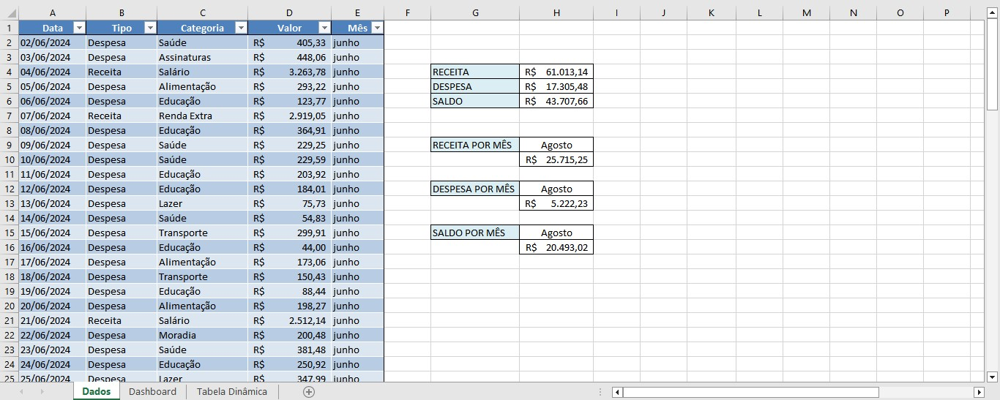
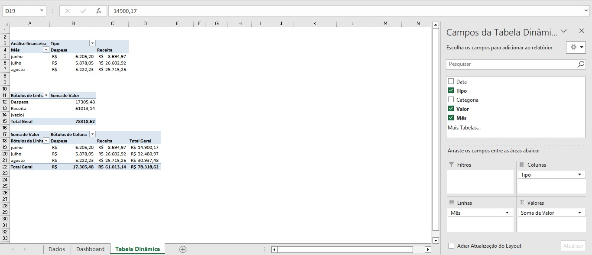
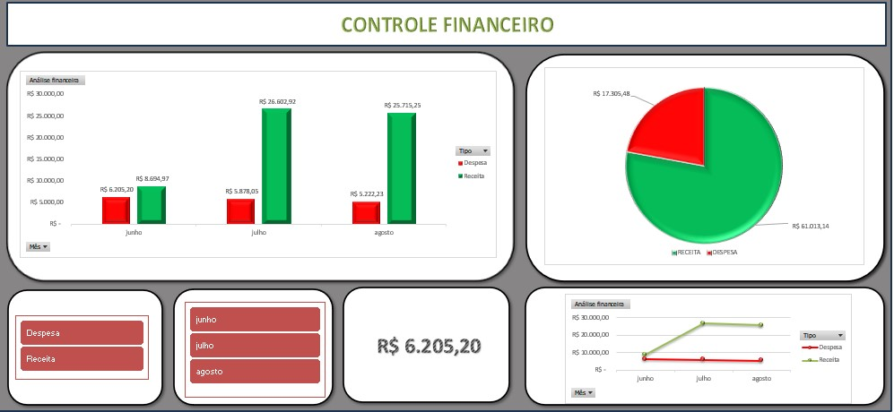

# 📊 Projeto de Controle Financeiro no Excel

Este projeto consiste em um **Dashboard Financeiro Interativo** desenvolvido no **Microsoft Excel**, com foco em controle de receitas, despesas e saldo mensal. Ideal para fins educacionais, prática com gráficos e análises de dados pessoais ou empresariais.

---

## ✅ Funcionalidades

- 📅 **Controle de receitas e despesas** mensais
- 📋 **Validação de dados** para manter consistência nos cadastros
- 📈 **Gráficos dinâmicos e visuais**: colunas, pizza e linha
- 🧮 **Cálculo automático** de saldo geral e por mês
- 🧊 **Segmentações de dados (Slicers)** para filtros rápidos por tipo e mês
- 📊 **Tabelas Dinâmicas** para análises consolidadas

---

## ⚙️ Técnicas e Recursos Utilizados

- `SOMASE` e `SOMASES` para totalizações condicionais
- Validação de dados por lista suspensa (drop-down)
- Criação de **Tabela Dinâmica**
- Criação de **Gráficos Dinâmicos**
- Aplicação de **Segmentação de Dados (Slicer)**
- **Design do Dashboard** com cartões de resumo e visual limpo

---

## 🧠 Aprendizados

- Manipulação de dados no Excel de forma estruturada
- Automatização de cálculos financeiros
- Visualização e análise de dados com elementos interativos
- Design de dashboards profissionais

---

## 🖼️ Capturas de Tela

### Base de Dados
-📋

### Tabela Dinâmica
-📊

### Dashboard Financeiro
-📈

---

